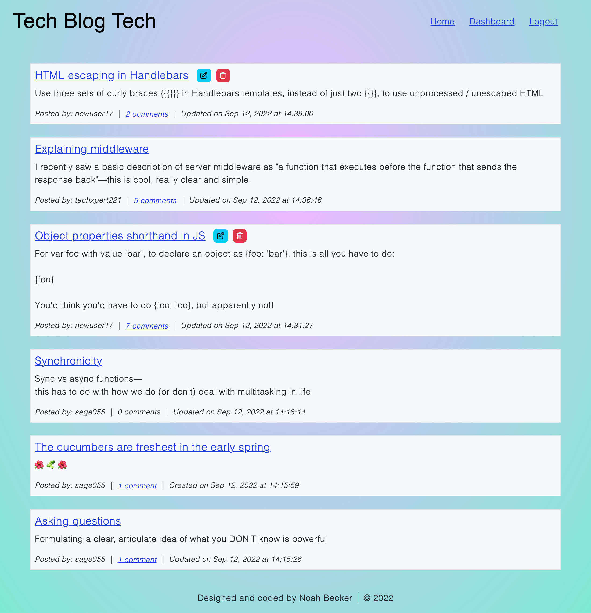
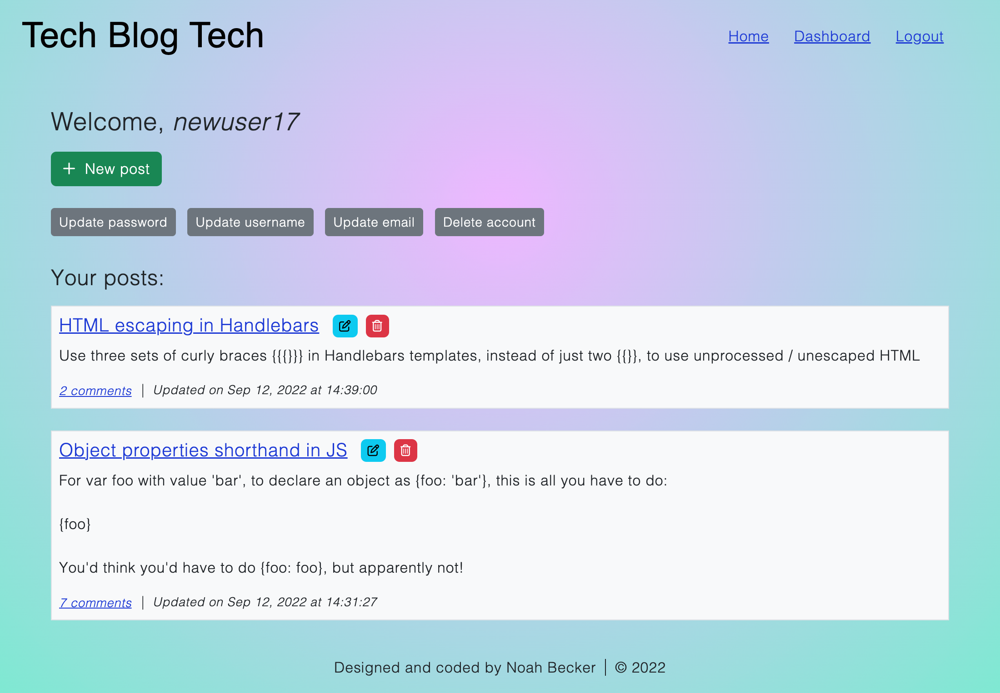

# Tech Blog Tech

    

## Repo
[https://github.com/noah35becker/tech-blog-tech](https://github.com/noah35becker/tech-blog-tech)

## Live application
[https://dry-beach-45731.herokuapp.com/](https://dry-beach-45731.herokuapp.com/)

## Description
This application is a blog for tech-related posts. The blog includes posting, commenting, and account management features.

<i><b>
## Table of contents

- [Credits](#credits)
- [License](#license)
- [Features](#features)
- [Directions for future development](#directions-for-future-development)
- [Contributing](#contributing)

- [Questions](#questions)
- [Screenshots of deployed application](#screenshots-of-deployed-application)
</i></b>

## Credits

### Creator
- Noah Becker ([GitHub](https://github.com/noah35becker))

### Third-party assets
- [Node.js](https://nodejs.org/)
- [MySQL](https://www.mysql.com/)
- [Handlebars](https://handlebarsjs.com/) template engine
- Node packages: 
    - [Express](https://www.npmjs.com/package/express)
    - [MySQL2](https://www.npmjs.com/package/mysql2)
    - [Express Session](https://www.npmjs.com/package/express-session)
    - [Express Handlebars](https://www.npmjs.com/package/express-handlebars)
    - [Sequelize](https://www.npmjs.com/package/sequelize)
    - [Connect Session Sequelize](https://www.npmjs.com/package/connect-session-sequelize)
    - [Bcrypt](https://www.npmjs.com/package/bcrypt)
    - [Luxon](https://www.npmjs.com/package/luxon)
    - [Dotenv](https://www.npmjs.com/package/dotenv)
- [Heroku](https://www.heroku.com/)
- [JawsDB MySQL](https://devcenter.heroku.com/articles/jawsdb)

## License

Learn more about this license [here](https://choosealicense.com/licenses/agpl-3.0).

## Features
- Account creation (username, email, password)
- Posting (can be edited / deleted)
- Commenting (can be deleted)
- Account management (update username/email/password, delete account)
- Login session timeout after 10 minutes of inactivity
- Responsive front-end design (adapts to different viewport/screen sizes)

## Directions for future development
- The <b>email</b> feature is only nominal at this time. It should be developed to actually include account management functionality, including account verification upon signup + account recovery.
- <b>Username and password validation</b> (minimum # of characters, required uppercase/lowercase/special characters, etc.) should be added.
- All screens that require a password should have the option to <b>show or hide</b> it while inputting.
- There are places on the application where it would be helpful to have the user <b>enter their password twice</b>.
- <b>Up- or down-voting posts and comments</b>
- A <b>search</b> feature
- The option to add <b>tags</b> to posts
- <b>Sorting / filtering</b> based on date, tag, user, etc.

## Contributing
Feel free to fork this project's [repo](https://github.com/noah35becker/tech-blog-tech), contribute code, and submit pull requests [here](https://github.com/noah35becker/tech-blog-tech/pulls)!

Contributors to this project must follow all guidelines set forth by the [Contributor Covenant](https://www.contributor-covenant.org/version/2/1/code_of_conduct/).

## Questions
My GitHub username is [noah35becker](https://github.com/noah35becker).

If you have any questions, I'd be glad to hear from you—contact me at [noahbeckercoding@gmail.com](mailto:noahbeckercoding@gmail.com).

## Screenshots of deployed application

Below are screenshots of the application (while logged in as `newuser17`):
 
 

Home page
 

 
User dashboard

 
A single post
